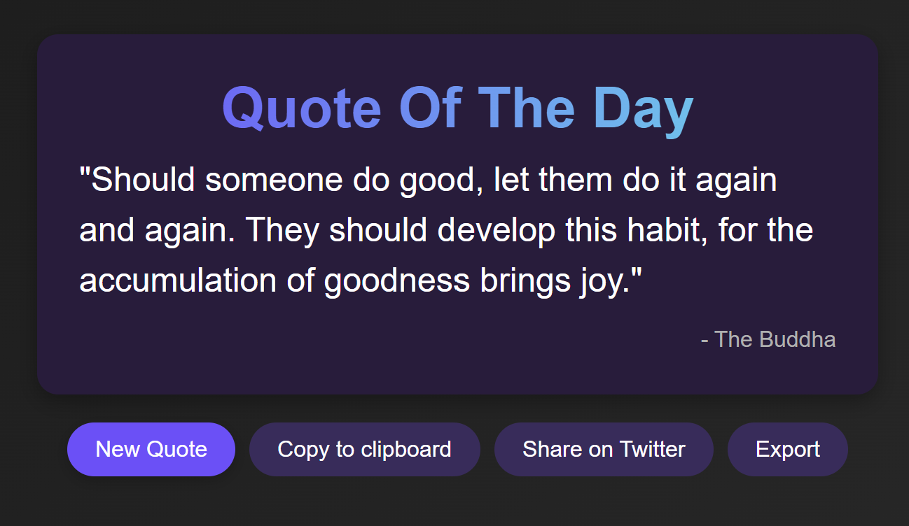

# Random Quote Generator

A simple web application that fetches and displays a random quote from an API, with features to copy, share, and export the quote.

## Features
- **Fetch Random Quote**: Retrieves a random quote and author from the API (`https://api.freeapi.app/api/v1/public/quotes/quote/random`).
- **Display Quote and Author**: Shows the quote and author on the page with a clean design.
- **New Quote Button**: Fetches a new random quote on click.
- **Copy to Clipboard**: Copies the quote and author to the clipboard.
- **Share on Twitter**: Shares the quote via a Twitter intent URL.
- **Export as Image**: Exports the quote as a PNG image using `html2canvas` (Bonus).
- **Random Background Image**: Sets a random background image behind the quote (Bonus).
- **Responsive Design**: Fully functional and visually consistent across mobile and desktop devices.

## Screenshots

## Deployment Link
[Live Demo](https://projects-nine-beta.vercel.app/)

## Technologies Used
- HTML
- CSS
- JavaScript
- `html2canvas` for image export
- API: `https://api.freeapi.app/api/v1/public/quotes/quote/random`

## How to Use
1. Open the app to see a random quote.
2. Click "New Quote" to fetch a new quote.
3. Use "Copy to Clipboard" to copy the quote.
4. Click "Share on Twitter" to share the quote.
5. Click "Export" to download the quote as an image.
